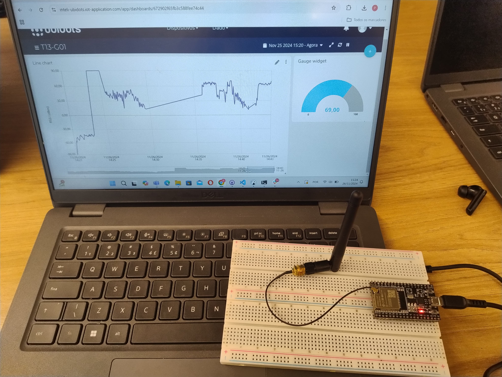
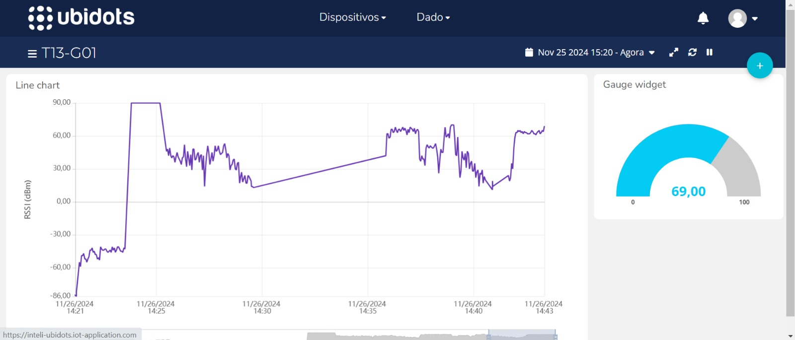

# Projeto IoT: Monitoramento do Sinal Wi-Fi com ESP32 e Ubidots

Este projeto consiste na utilização de um **ESP32** para monitorar a potência do sinal Wi-Fi (RSSI) em dBm, enviando os dados em tempo real para a plataforma **Ubidots** por meio do protocolo **MQTT**. A atividade inclui a criação de uma dashboard para exibir os dados, permitindo a análise do comportamento do sinal em diferentes cenários, como a simulação de uma gaiola de Faraday ao utilizar um elevador.

---

## Circuito

### Componentes do Circuito

- **ESP32**: Microcontrolador utilizado para conectar ao Wi-Fi, medir o RSSI e publicar os dados no Ubidots.
- **Antena do Hotspot**: Fonte do sinal Wi-Fi, configurada em um smartphone como ponto de acesso.

### Esquema do Circuito

<div align="center">
    
</div>

### Explicação do Circuito

1. **ESP32**:
   - Conecta-se ao Wi-Fi configurado como hotspot em um smartphone.
   - Mede o valor do **RSSI** (Received Signal Strength Indicator), que indica a qualidade do sinal.
   - Publica os valores no Ubidots via MQTT.
2. **Antena do Hotspot**:
   - Configurada em um smartphone para simular diferentes cenários de distância e obstruções no sinal Wi-Fi.

---

## Código

O código foi desenvolvido em **C++** utilizando a biblioteca **UbidotsEsp32Mqtt** para conectar ao Wi-Fi, realizar a medição do sinal e enviar os dados ao Ubidots. Também disponível através do seguinte [link](./code.cpp)

```cpp
#include "UbidotsEsp32Mqtt.h"

const char *WIFI_SSID = "Iphone15"; // SSID do Wi-Fi
const char *WIFI_PASS = "senhadarede";  // Senha do Wi-Fi

const char *UBIDOTS_TOKEN = "BBUS-YvRNja0v0CjGesChRsmWQBEJdlE61K"; 
const char *DEVICE_LABEL = "esp32_iotrackers"; 
const char *VARIABLE_LABEL = "wifi_signal"; 
const char *CLIENT_ID = "iotrackers";

Ubidots ubidots(UBIDOTS_TOKEN, CLIENT_ID);

const int PUBLISH_FREQUENCY = 3000; // Taxa de publicação (ms)
unsigned long timer;
uint8_t pinLED = 2;

void callback(char *topic, byte *payload, unsigned int length) {
  Serial.print("Mensagem recebida [");
  Serial.print(topic);
  Serial.print("] ");
  for (int i = 0; i < length; i++) {
    Serial.print((char)payload[i]);
  }
  Serial.println();
}

void setup() {
  Serial.begin(115200);
  ubidots.setDebug(true);
  ubidots.connectToWifi(WIFI_SSID, WIFI_PASS);
  ubidots.setCallback(callback);
  ubidots.setup();
  ubidots.reconnect();

  pinMode(pinLED, OUTPUT);
  timer = millis();
}

void loop() {
  if (!ubidots.connected()) {
    ubidots.reconnect();
  }

  if (millis() - timer > PUBLISH_FREQUENCY) {
    int rssi = WiFi.RSSI();
    rssi = rssi + 90; // Ajuste para valores positivos

    Serial.print("RSSI: ");
    Serial.println(rssi);

    ubidots.add(VARIABLE_LABEL, rssi);
    ubidots.publish(DEVICE_LABEL);
    timer = millis();
  }

  ubidots.loop();
}
```

---

## Funcionamento do Projeto

1. **Conexão ao Wi-Fi**: O ESP32 conecta-se ao ponto de acesso (hotspot) configurado em um smartphone.
2. **Medição do Sinal**: A cada intervalo de 3 segundos, o ESP32 lê o RSSI (indicador de potência do sinal).
3. **Envio de Dados**: O valor medido é publicado no Ubidots via MQTT.
4. **Visualização no Ubidots**:
   - Um gráfico contínuo exibe a variação do sinal Wi-Fi ao longo do tempo.
   - Um medidor do tipo *gauge* mostra o valor atual do RSSI.

---

## Dashboard no Ubidots

<div align="center">
    
</div>

### Gráficos Criados

1. **Gráfico de Linha**:
   - Exibe a variação do RSSI ao longo do tempo.
   - Utilizado para identificar mudanças na qualidade do sinal, como a redução dentro do elevador.
2. **Gauge (Medidor)**:
   - Mostra o valor atual do RSSI em tempo real.

---

## Demonstração

A demonstração do projeto foi gravada em vídeo, mostrando o funcionamento do sistema e os resultados dos testes:

1. **Distância do Hotspot**:
   - Movimentamos o smartphone com o hotspot para diferentes distâncias do ESP32, observando a redução gradativa no sinal Wi-Fi.
2. **Simulação de Gaiola de Faraday**:
   - Entramos no elevador com o smartphone (hotspot), simulando o bloqueio do sinal Wi-Fi.
   - No gráfico, observamos a redução drástica do RSSI até a interrupção total do sinal. Quando saímos do elevador, o sinal foi gradualmente restabelecido.

### Links para os Vídeos:

- **Local**: [Clique aqui para baixar o vídeo](./assets/Teste_Wifi_Esp32_Ubidots.mp4)
- **Google Drive**: [Assista ao vídeo no Google Drive](https://drive.google.com/file/d/1SBXYIGs0_yGJXmbmtagQIZOZq9z7JVo9/view?usp=sharing)

---

## Observações Finais

- **Configuração do ESP32**:
  - Certifique-se de configurar o SSID e a senha corretos para conectar ao Wi-Fi.
  - A biblioteca utilizada pode ser encontrada no [repositório](https://github.com/agodoi/m04-semana05) disponibilizado pelo professor André Godoi.
- **Testes Realizados**:
  - Distância variável entre ESP32 e hotspot.
  - Bloqueio de sinal com uma gaiola de Faraday simulada (elevador).
- **Resultados**:
  - O sistema demonstrou capacidade de registrar mudanças sutis e drásticas no RSSI, com visualização clara na dashboard.

---
